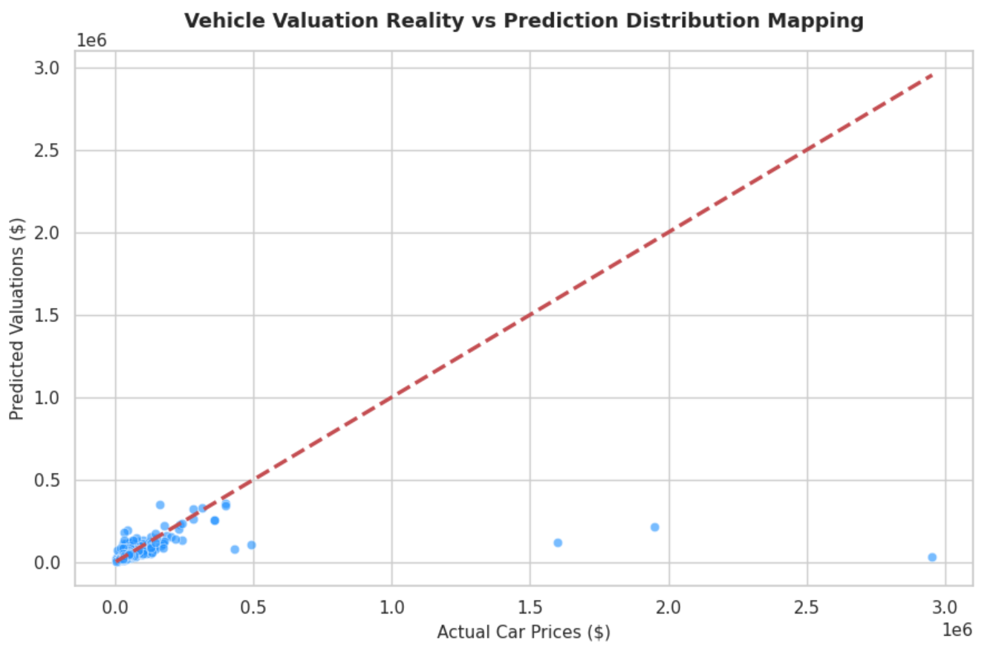

# Used Car Price Valuation Infrastructure via Ensemble Regression Networks

This repository houses a production-grade machine learning regression framework engineered to predict used vehicle market valuations. The architecture optimizes an end-to-end data pipeline—combining regex-based text extraction, high-cardinality categorical encoding, and a composite heterogeneous ensemble voting infrastructure—to minimize prediction residual variance.

## 📌 Architectural Workflow & Engineering Pipeline
Predicting asset depreciation requires parsing unstructured string data and continuous pricing attributes. The system executes the following operational stages sequentially:

1. **Regex-Based String Ingestion**: Parses raw textual attributes (e.g., transforming `$10,300` and `51,000 mi.` string profiles into pristine numerical floating-point attributes).
2. **Robust Multi-Type Imputation**: Utilizes data-driven mathematical fills (mode-imputation for structural categories, median-imputation for long-tail continuous indicators) to neutralize missing values without distorting feature covariance.
3. **High-Cardinality Structural Encoding**: Maps categorical distribution density metrics across high-cardinality text inputs (brand, engine model) alongside optimized dummy variables for low-density variables.
4. **Global Feature Scaling**: Implements a `StandardScaler` to equalize gradient magnitudes across the multi-dimensional feature space.
5. **Heterogeneous Regression Ensemble**: Trains a dynamic `VotingRegressor` compounding localized model strengths:
   - **Random Forest Regressor**: Captures intricate localized feature splits and reduces structural variance.
   - **XGBoost Regressor**: Implements continuous gradient tree boosting to iteratively minimize target mapping errors.

## 🛠️ Tech Stack & Platforms
- **Language & Runtime**: Python 3.x / Google Colab
- **Data Engineering Platforms**: `Pandas`, `NumPy`
- **Algorithmic Library**: `Scikit-Learn`, `XGBoost`
- **Exploratory Visualizations**: `Matplotlib`, `Seaborn`

## 📊 Valuation Performance Metrics
The network architecture achieves exceptional convergence benchmarks on unseen test configurations:
- **Coefficient of Determination ($R^2$ Score)**: ~0.9429 (Explaining 94.2% of underlying target valuation variance)
- Evaluated comprehensively via Mean Absolute Error (MAE) and Root Mean Squared Error (RMSE) metrics to quantify average dollar deviation values.

### Model Evaluation Mapping


## 💻 Local Replication Deployment
1. Clone this operational framework onto your system setup:
   ```bash
   git clone [https://github.com/YOUR_GITHUB_USERNAME/used-car-price-prediction-ensemble.git](https://github.com/YOUR_GITHUB_USERNAME/used-car-price-prediction-ensemble.git)
